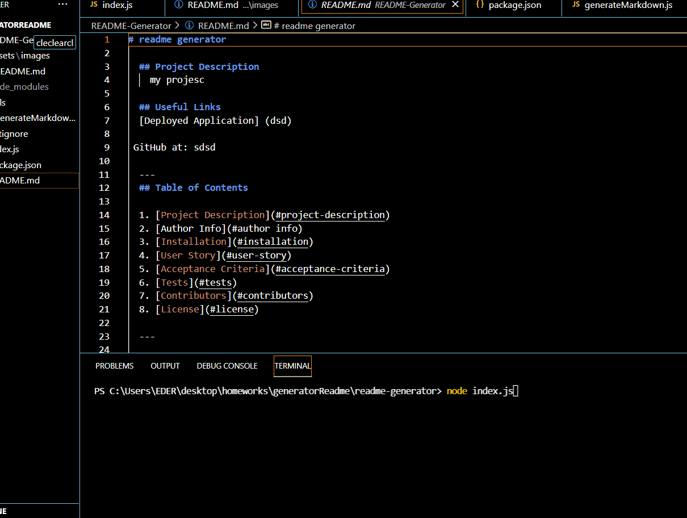

# README GENERATOR
## Description

Receiving inputs from the user (developer), this project should automatically generate a professional readme file reflecting the users input. This project will be developed using Git, NodeJS and NPM Module Inquirer.
A command-line application that dynamically generates a README.md from a user's input. The application will be invoked with the following command:
``` 
node index.js
``` 
  ---
## Useful Links
[Deployed Application] (https://kdher.github.io/README-Generator/)  
GitHub at: https://github.com/kdher/README-Generator
  
  ## Table of Contents

  1. [Project Description](#project-description)
  2. [Author Info](#author info)
  3. [Installation](#installation)
  4. [User Story](#user-story)
  5. [Acceptance Criteria](#acceptance-criteria)
  6. [License](#license)

  ---

  ## Author Info
  
  
  
 
  
 If you have any questions, contact the author directly at edher.fca@gmail.com
  ---

  ## Installation
  Packages required to run this program are: inquirer
  
  
   ## User Story
    ```md
   AS A developer
   I WANT a README generator
   SO THAT I can quickly create a professional README for a new project
   ```

   ## Acceptance Criteria
   
  ```md
  GIVEN a command-line application that accepts user input
  WHEN I am prompted for information about my application repository
  THEN a high-quality, professional README.md is generated with the title of my project and sections entitled Description, Table of Contents, Installation, Usage, License, Contributing, Tests, and Questions
  WHEN I enter my project title
  THEN this is displayed as the title of the README
  WHEN I enter a description, installation instructions, usage information, contribution guidelines, and test instructions
  THEN this information is added to the sections of the README entitled Description, Installation, Usage, Contributing, and Tests
  WHEN I choose a license for my application from a list of options
  THEN a badge for that license is added near the top of the README and a notice is added to the section of the README entitled License that explains which license the application is covered under
  WHEN I enter my GitHub username
  THEN this is added to the section of the README entitled Questions, with a link to my GitHub profile
  WHEN I enter my email address
  THEN this is added to the section of the README entitled Questions, with instructions on how to reach me with additional questions
  WHEN I click on the links in the Table of Contents
  THEN I am taken to the corresponding section of the README
  ```
  ## Technologies Used

 - HTML5
 - CSS
 - Github
 - JavaScritp
 - Node.js

  ## Screenshot
  
  ## License
  APACHE 2.0

  